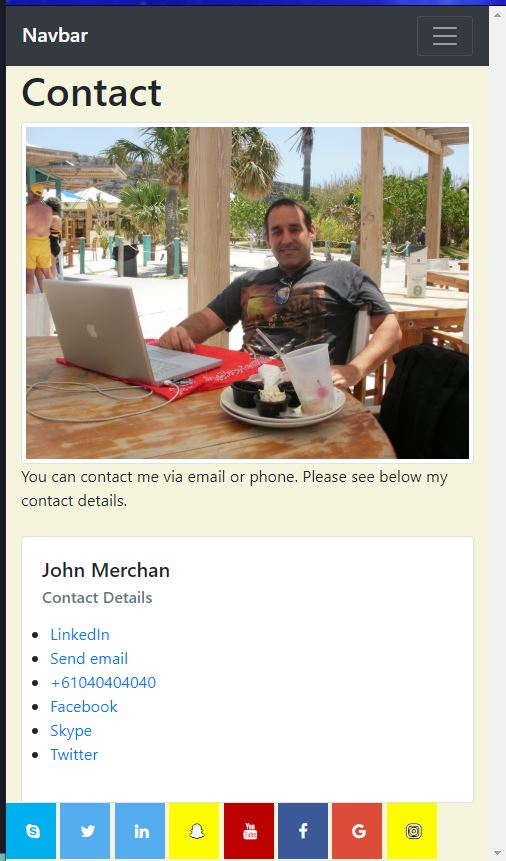

# Project Title

Creating a professional portfolio displaying important information regarding my skill-set and background experience in IT.

## Eaxmples

## Getting Started

This is a 4 page website design. It has CSS and Javascript. 
All the required elements are included in the root folder, haing a sub-folder assets, which also includes a sub-folder images. 

### Prerequisites

Runs on Chrome, Internet explorer 11+, Firefox, Opera, Safari.

### Installing

There is no installation required.

## Running the tests

The use of the layout was done on Chrome using the inspect tool to tweak to the desired effect.

### And coding style tests

Created the basic HTML and then added the internal comments breaking it up into sections depending on the type of page I planed on building.
Then I added the Bootstrap elements per page and ensured it was working with placeholders.
Added the RAW content to each page.
Then added the social media icons/links at the footer of each page.
Updated the README with the project built. 

## Built With

* [Vscode](http://www.vscode.com) - The code editor used.
* [GIT](/https://git-scm.com/) - Version control.
* [Chrome](https://www.chrome.com) - Visual layout testing.

## Authors

* **John Merchan** - *Complete work* - [2ndAssignment](https://github.com/johnnyboysydney/2ndAssignment)

## Acknowledgments

* I thank the TA and the Teacher who gave me valuable feedback during the classes to be able to create this website.
* I took the inspiration of the wbsite from the excercise which I found simple but very efective with a lot of potentional to style extensively.

Copyright 2020 &copy; John Merchan
